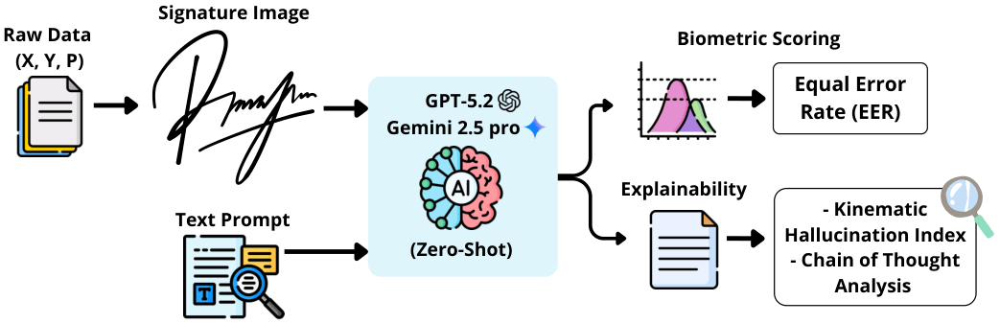

# Kinematic hallucinations in vision-language models: A study on zero-shot signature verification

Official repository for the paper: **"Kinematic hallucinations in vision-language models: A study on zero-shot signature verification"**.


<p align="center">
  
</p>

[](https://www.sciencedirect.com/journal/pattern-recognition-letters)

---

## About the Study

This repository contains the experimental framework for the first study evaluating the **zero-shot performance** of commercial Vision-Language Models (VLMs) (GPT-5.2 and Gemini 2.5 Pro) in the context of forensic signature verification. 

Our research identifies a significant "Rationalization Trap": while VLMs demonstrate exceptional geometric reasoning in random forgery scenarios, they are susceptible to **kinematic hallucinations** in skilled forgeries, where they fabricate motor-related dynamics (such as speed or pressure) to justify morphological decisions.

### Key Contributions:
* **Large-scale evaluation:** Analysis of 45,520 comparisons across three diverse forensic tasks.
* **Kinematic-Encoded Representation:** A preprocessing framework that maps normalized pressure $P(t)$ to grayscale stroke intensity to assess its impact on model reasoning.
* **Kinematic Hallucination Index (KHI):** A new linguistic metric proposed to quantify the density of hallucinated kinematic descriptions in the models' forensic rationales.
* **Probabilistic Scoring:** Extraction of latent token probabilities (logprobs) to compute continuous similarity scores for Equal Error Rate (EER) analysis.

---

## Experimental Protocol

### Dataset & Tasks
We utilized the evaluation dataset of the **Signature Verification Challenge (SVC)** published by R. Tolosana, et al. at Pattern Recognition in 2022. [SVC-onGoing: Signature Verification Competition](https://doi.org/10.1016/j.patcog.2022.108609):
* **Task 1 (Office - Stylus):** 6,000 comparisons with digital pen (pressure included).
* **Task 2 (Mobile - Finger):** 9,520 comparisons via finger input.
* **Task 3 (Combined):** 12,000 comparisons for cross-device analysis.

### Signature Preprocessing
Since VLMs are blind to raw time-series data, we transform the signals into static images. For Tasks 1 and 3, we implement a pressure-encoded representation where high-pressure segments are mapped to darker strokes, providing the VLM with visual grounding for movement analysis.

### System Prompt
The models are instantiated as Forensic Document Examiners. We utilize a two-stage reasoning strategy to extract an initial visual impression followed by a reflective verdict after a Chain-of-Thought (CoT) phase:

```python
SYSTEM_PROMPT = """You are a Forensic Document Examiner. You must analyze AI generated signatures and output a Strict JSON, verifying if they belong to the same identity.
Output STRICT JSON in this order:
{
  "initial_verdict": "Same Identity" or "Different Identity" ONLY THIS,
  "analysis": "Technical comparison (Topology:, Geometry:)",
  "certainty": "0-100". Try not to give exactly 0 or 100.,
  "final_verdict": "Same Identity" or "Different Identity ONLY THIS"
}"""
```
---
## Repository Structure

The repository is organized as follows to ensure the full reproducibility of the experimental framework:

* `image_generation/`: Scripts to transform raw time-series sensor data ($X, Y, P$) into static representations, including both binary strokes and pressure-encoded grayscale mapping.
* `vlm_inference/`: Implementation for GPT-5.2 and Gemini 2.5 Pro API interactions, configured with deterministic parameters (Temperature $= 0.0$, Seed $= 42$) and logprob extraction for GPT-5.2.
* `metrics/`: Tools for calculating biometric and linguistic performance, including:
    * Equal Error Rate (EER): Continuous similarity scoring from log-probabilities.
    * Kinematic Hallucination Index (KHI): Quantitative measurement of "Rationalization Trap" density.
    * Adjective Density: Linguistic analysis of subjective descriptors using SpaCy.
